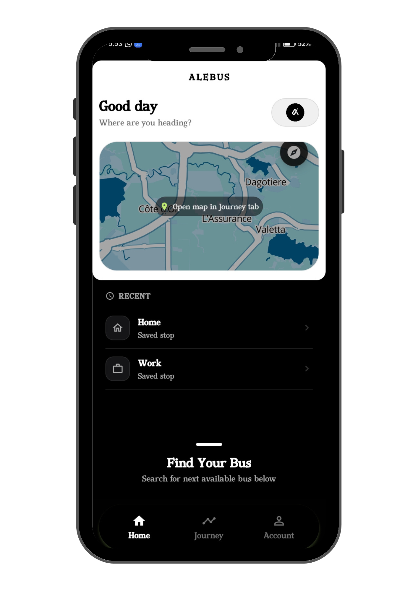
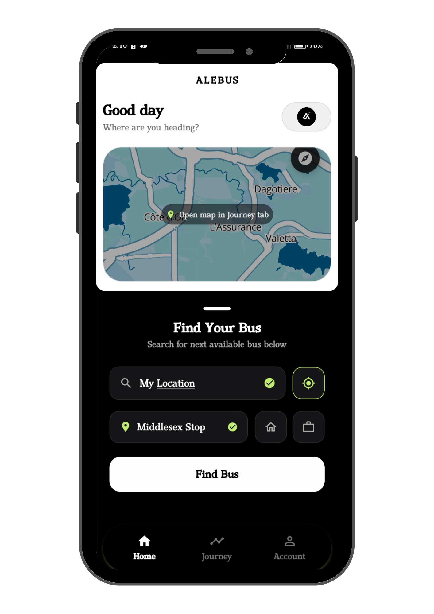
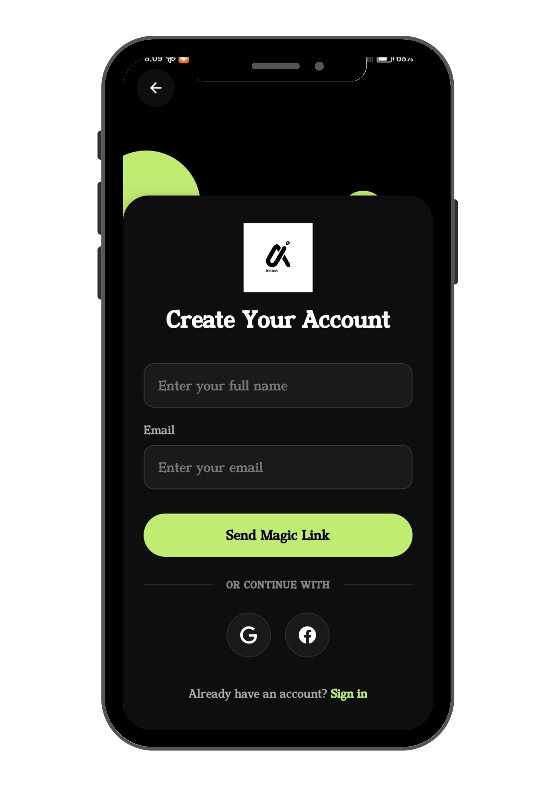
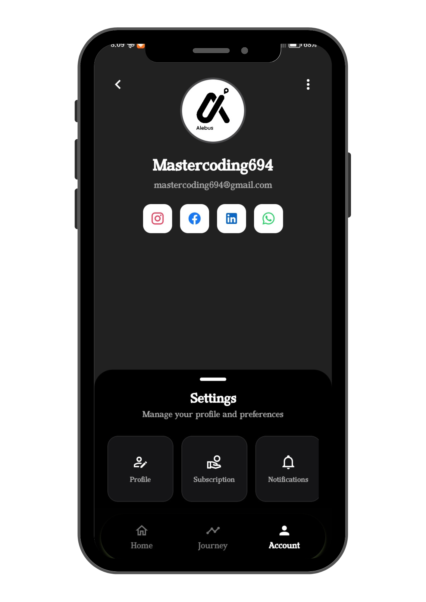

# Alebus Mobile

**Real-time bus tracking app for Mauritius — React Native commuter client**

A passenger opens the app, types where they are and where they want to go, and the app finds the next available bus on that route. A live map shows the bus moving in real time, a navigation banner updates stop-by-stop, and a route polyline traces the remaining road distance to the boarding stop — updating continuously as the bus moves.


> **Part of the Alebus platform.** This app is the commuter-facing client. See [`alebus-api`](https://github.com/MathewM27/alebus-api) for the Go backend that powers it.

---

## Screenshots

<table>
  <tr>
    <td align="center"><br/><sub>Home</sub></td>
    <td align="center"><br/><sub>Stop Search</sub></td>
    <td align="center"><br/><sub>Live Tracking</sub></td>
  </tr>
  <tr>
    <td align="center"><br/><sub>Sign In</sub></td>
    <td align="center"><br/><sub>Settings</sub></td>
    <td></td>
  </tr>
</table>

---

## Architecture

The app connects to the Alebus backend via REST for journey creation and stop data, and via two simultaneous WebSocket connections for live bus position updates.

```
┌──────────────────────────────────────────────────────────┐
│                    React Native App                      │
│                                                          │
│  ┌─────────────┐  ┌──────────────┐  ┌────────────────┐  │
│  │  Home Tab   │  │ Journey Tab  │  │  Settings Tab  │  │
│  │  Stop search│  │  Live map    │  │  Theme, profile│  │
│  │  Shortcuts  │  │  Nav banner  │  │                │  │
│  └──────┬──────┘  └──────┬───────┘  └────────────────┘  │
└─────────┼────────────────┼──────────────────────────────┘
          │ REST            │ WebSocket (×2)
          ▼                 ▼
┌─────────────────┐  ┌──────────────────────────────────┐
│  Alebus Backend │  │     rawPositionClient             │
│  (Go API)       │  │     ~1s cadence — raw GPS frames  │
│                 │  ├──────────────────────────────────┤
│  Journey create │  │     busMuxClient                  │
│  Stop lookup    │  │     ~2–3s — enriched frames with  │
│  Route data     │  │     segmentPct + journey state    │
│  Shortcuts      │  └──────────────────────────────────┘
└─────────────────┘
          │
          ▼
┌─────────────────┐
│  Cloudflare     │
│  Worker         │
│  Map tile styles│
│  (dark + light) │
└─────────────────┘
```

---

## Key Technical Decisions

### Dual WebSocket architecture

The app maintains two simultaneous WebSocket connections to the backend:

**`rawPositionClient`** — receives raw GPS frames at ~1 second cadence. No stop enrichment, but fast. Used exclusively to keep the map marker moving between enriched frames.

**`busMuxClient`** — receives enriched frames at ~2–3 second cadence. Each frame includes `segmentPct` (fractional position 0–1 along the full route polyline), stop index, proximity level, and journey state. Drives the route polyline, navigation banner, and journey lifecycle.

The two channels are combined in `useBusPosition` — raw frames keep the visual marker fluid, enriched frames provide accurate semantic state. Using a single channel for both would mean either a slow-moving marker (enriched rate) or a semantically uninformed UI (raw rate).

### LERP position smoothing (`useBusPosition`)

A `setInterval` at 50ms (20 fps) drives a cubic ease-out interpolation between the last known GPS position and the latest incoming target coordinate. The camera follows at GPS update rate (separate from LERP ticks) to avoid fighting user gestures. Sequence and timestamp guards discard out-of-order frames that arrive during WebSocket reconnects.

```typescript
// Cubic ease-out: fast start, smooth arrival at target
const t = Math.min(elapsed / LERP_DURATION, 1);
const eased = 1 - Math.pow(1 - t, 3);
interpolatedLat = lastPos.lat + (targetPos.lat - lastPos.lat) * eased;
```

### `segmentPct`-based route geometry

All road geometry is derived from a single float — `segmentPct` — rather than a stop index. Given the ordered stop list and per-segment `pathToNext` polylines from the API, `routeSegmentFromPct` walks the cumulative distance array to find exactly which road vertex the bus is on, then returns the forward slice of geometry to the boarding stop. `findStopAtPct` does the same for navigation banner labels, using haversine proximity (≤30m) when live coordinates are available.

This approach means route geometry updates smoothly as `segmentPct` changes — no discrete jumps between stops.

### Cross-route polylines

When the backend matches a bus that is still completing a paired route before starting the user's route (e.g., a bus coming from the opposite direction that will arrive at the terminal and begin the user's route), `crossRouteSegmentFromPct` builds a two-part polyline: bus → current route's terminal, then user's route start → boarding stop. This handles the common Mauritius bus pattern where outbound and inbound routes are operated as a single continuous run.

### Map tiles via Cloudflare Worker

Tile style URLs are served from a Cloudflare Worker rather than bundled in the app. Dark and light map styles can be updated server-side without requiring an app release. URLs are fetched on launch and persisted to `AsyncStorage`.

### Camera modes

Three camera modes manage the map view during live tracking:

- **Follow** — camera locked to bus position, updates at GPS rate
- **Overview** — camera bounds both the bus and the user's boarding stop
- **Free** — user is panning; camera auto-relocks to Follow 10 seconds after the last gesture

---

## Tech Stack

| Layer | Choice |
|---|---|
| Framework | React Native via Expo (SDK 54, New Architecture enabled) |
| Routing | Expo Router (file-based, typed routes) |
| Map | MapLibre React Native — custom tile styles via Cloudflare Worker |
| Animation | React Native Reanimated 4 (shared values, worklets) |
| Gestures | React Native Gesture Handler |
| Auth | Supabase JS — magic link + Google OAuth (PKCE) |
| Real-time | Two WebSocket connections: `busMuxClient` + `rawPositionClient` |
| Persistence | AsyncStorage (map theme), Expo SecureStore (session) |
| Build | EAS Build — development and production workflows |

---

## Project Structure

```
alebus-mobile/
│
├── app/
│   ├── (auth)/               Welcome, sign-in, sign-up, OAuth callback
│   ├── (boot)/               Boot layout — waits for auth + storage before routing
│   ├── (modals)/             Journey details + stop info modal screens
│   ├── (tabs)/               Main tabs: Home, Journey, Search, Settings
│   └── _layout.tsx           Root layout — AuthProvider, MapThemeProvider, navigation
│
├── components/
│   ├── auth/                 AuthInput, PillButton, SocialLoginButton
│   ├── journey/              ActiveJourneySection, ShortcutsSection
│   ├── settings/             MapThemeSection, ProfileEditSection
│   └── Map.tsx               MapLibre map — LERP marker, route polyline, camera modes
│
├── contexts/
│   ├── AuthContext.tsx        Session state, backend registration, token auto-refresh
│   ├── JourneyContext.tsx     Journey lifecycle, active journey state
│   └── MapThemeContext.tsx    Dark/light tile URLs, AsyncStorage persistence
│
├── hooks/
│   ├── useBottomSheet.ts      Custom drag-snap sheet (Reanimated + Gesture Handler)
│   ├── useBusPosition.ts      LERP interpolation + dual WebSocket subscription
│   └── useStopLookup.ts       Stop autocomplete
│
├── services/
│   ├── api/                   Typed REST wrappers: buses, journey, stops, users
│   └── ws/
│       ├── busMuxClient.ts    Enriched frames — auto-reconnect, sequence guards
│       └── rawPositionClient.ts  Raw GPS frames — lazy connect, auto-reconnect
│
└── utils/
    ├── routeGeometry.ts       segmentPct → road position, polylines, cross-route logic
    ├── journeyTracking.ts     Journey state machine helpers
    └── activeJourneyViewModel.ts  Derives display state from raw journey + position data
```

---

## Bottom Sheet

The home and journey screens use a custom drag-and-snap bottom sheet built with Reanimated shared values and Gesture Handler pan gestures — not a third-party sheet library.

Four snap points (15 / 20 / 55 / 92% visible). The 92% snap is keyboard-only (not drag-accessible), activated when the shortcut edit form is open to keep the input above the keyboard. An overscroll glow effect fires via a separate animated view when the sheet is dragged past its top snap point.

---

## Journey Lifecycle

```
Stop search → Journey created (REST POST)
        │
        ├── 409 Conflict → existing active journey reloaded
        │
        ▼
Live tracking (dual WebSocket)
        │
        ├── Bus approaching → proximity alerts in nav banner
        ├── Bus at boarding stop → "Board now" state
        └── Journey cancelled → sockets closed, state reset

App foregrounded with active journey:
  → Backend queried for non-terminal journeys
  → Tracking resumes without re-creating
```

---

## Known Limitations

- **Search tab** — renders correctly but is not wired to any API; stop search is only available on the Home tab
- **Recent trips** — home screen rows are static placeholder data, not pulled from journey history
- **Subscription UI** — settings screen renders the subscription section but it is not connected to any payment or entitlement system

---

## Related Repositories

| Repository | Description |
|---|---|
| [`alebus-api`](https://github.com/MathewM27/alebus-api) | Go backend — GPS ingestion, WebSocket fan-out, journey matching |
| [`alebus-dashboard`](https://github.com/MathewM27/alebus-dashboard) | Next.js operator fleet dashboard |

---

*Part of the [Alebus](https://github.com/MathewM27/alebus-api) platform · Built by [Mathews Mwangi](https://mathewsmwangi.com)*
